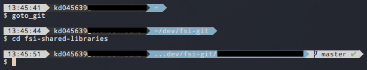

Feel free to contribute and share!  And also reach out for any questions! I love expanding my range of laziness and also helping!(:

## Theme
Oh don't get me wrong. I do miss cmder a ton, but I also love how my terminal looks!



I'm using the iTerm theme [Bullet Train](https://github.com/caiogondim/bullet-train.zsh).

In your `.zshrc` file, have the following somewhere around the top:

```bash
ZSH_THEME="bullet-train"
```  
<br>
## Computer Name
Shout out to: [Veronica Mazur](mailto:veronica.mazur@cerner.com)!
She showed me how to customize my computer name in iTerm2!  

I'm using a method from [this StackOverflow](https://stackoverflow.com/questions/28491458/zsh-agnoster-theme-showing-machine-name/38295938#38295938).  I want to be able to do it through my custom `.zshrc` instead of editing the theme itself.  That way, if I transfer laptops, I don't have to worry about editing the theme again, since my user preferences will override the exact values I need.

1. Towards the bottom of my `.zshrc` file (before my `SDKMAN_DIR`, I create the following method called `prompt_context()`.
    ```bash
    prompt_content() {
      if [[ "$USER" != "$DEFAULT_USER" || -n "$SSH_CLIENT" ]]; then
        // Customization goes here
      fi
    }
    ```
2. Veronica provided [this guide on "Simple Prompt Escapes"](http://www.manpagez.com/man/1/zshmisc/) to assist with those colors/emojis!


For example, mine looks like this:  


```bash
prompt_context() {
  if [[ "$USER" != "$DEFAULT_USER" || -n "$SSH_CLIENT" ]]; then
    prompt_segment black default "%{$fg_bold[cyan]%}ThyRex 🦖 %{$reset_color%}:%"
  fi
}
```  
<br>
## Aliases/Shortcuts

I'm a pretty lazy person. As in so lazy, my least favorite things to do are:

1. Navigating to a directory in terminal for my hosts or a certain project.
2. Honestly, typing `git commit -a -m...` or `git push origin...`
3. Changing java versions.

So I created my own aliases in my `~/.zshrc` file to further my laziness and modified my GitHub global config.

* [Thy's lazy .zshrc]({{ "/" | relative_url }}/assets/script-dls/thy.zshrc) (Downloadable file)
    - Rename to `.zshrc` to use
* Thy's lazy git config:
    > git config --global --edit

    ```
    [alias]
        st = status
        ci = commit
        br = branch
        co = checkout
        gp = git push
        gpl = git pull
        g = git
        gc = git commit -a -m
        gco = git checkout
        gcl = git clone
        ga = git add
        gst = git status
    ```
